## 前期分析

-   [基本信息介绍](https://pauke.netlify.app/2022/10/14/guangfo-convenience-exploration-with-poi-data/)
-   [POI数据分部分介绍](https://pauke.netlify.app/2022/10/17/guangfo-convenience-exploration-with-poi-data/)
-   [聚类模型构建和结论](https://pauke.netlify.app/2022/10/18/guangfo-convenience-exploration-with-poi-data-3/)

## 思路与分析过程


sequenceDiagram 
    数据收集->>数据整理: 数据完备性和解释力判断
    数据整理->>数据展示: 展示方式选择与调整 
    Note over 数据收集,数据展示:选择以街道乡镇层级为分析基础
    数据展示-->>数据收集:调整需求数据类型（区县单位调整为街乡单位）
    数据收集->>数据展示:数据完备性和解释力探查，分析思路构思 
    Note over 数据收集,数据展示:由单独分析广州，拓展为广佛一体 
    数据展示-->>数据收集:调整需求数据范围 
    Note over 数据整理,数据展示:分不同poi类型展示和探查情况 
    数据展示-->>数据整理:确认具有分析价值且质量合格的变量 
    数据整理->>模型数据清理:归集整理为模型需要的数据 
    模型数据清理->>模型构建:尝试不同分析方式和参与变量 
    Note over 模型数据清理,模型产出与结论:对比不同聚类方式 
    模型产出与结论-->>模型构建: 根据结论调整建模方式 
    Note over 模型产出与结论,模型构建: 得出PCA合并聚类的最终方案
    模型构建->>模型产出与结论: 确认最终结论展示方式


## 具体问题

### POI数据取舍

关于数据来源已经在[基本信息介绍](https://pauke.netlify.app/2022/10/14/guangfo-convenience-exploration-with-poi-data/)有了完备的列示，不过，对于源数据中包含的覆盖面，在那篇文章中没有详细展开。在[源数据](https://youwuqiong.top/405807.html)中，广州方面的共计包括了：

-   地铁站
-   公交站
-   公园
-   写字楼
-   医院
-   商场
-   学校
-   小区
-   超市
-   酒店
-   银行
-   餐饮
-   菜市场
-   政府机构
-   ~~加油站~~
-   ~~工厂~~
-   ~~邮政~~

其中，「加油站、工厂和邮政」则是因为未包含在佛山的数据中，为了便于广佛数据的统一，便未纳入当时的列举。

接下来其他类别的选择，之前提及的1）服务文章主题目的和2）数据质量
两条思路，根据这两条思路进行的筛选，已经在[第一篇](https://pauke.netlify.app/2022/10/14/guangfo-convenience-exploration-with-poi-data/)中有了阐述，在此不在复述。还有一个隐形的，与poi数据自身性质带来的问题：3）数据点在空间中的代表性问题，则没有展开讨论过。

POI数据作为一种由单点经纬度构成的数据，本身在空间投射中，就只是一个点。对于类似于地铁、公交、便利店等本身面积不算很大的实体地理对象而言，只要在一定程度小的比例尺坐标体系里，其投射出来的拓扑形状可以很好的被点所代表。但对于小区、工厂、商场等较大面积的个例数量不少的对象，在城市层级的比例尺地图中，就很难用点就能准确描述，先不论该类poi的数据的选取标准和执行质量问题，用点作为这类对象的拓扑代表就会存在一定的失真。

### POI数据展示方式

POI数据可行的挖掘方式在[这篇文章](http://rstudio-pubs-static.s3.amazonaws.com/273435_fae224d6bfc24779a165ee49427bb57f.html)中有较好的总结：

-   交互式散点

    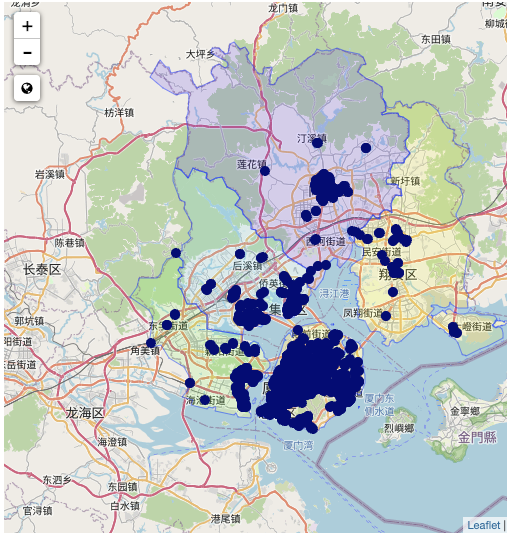

-   点密度

    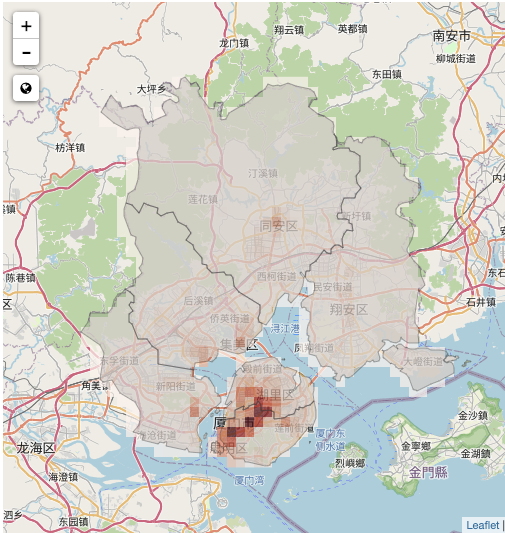

-   点聚类

    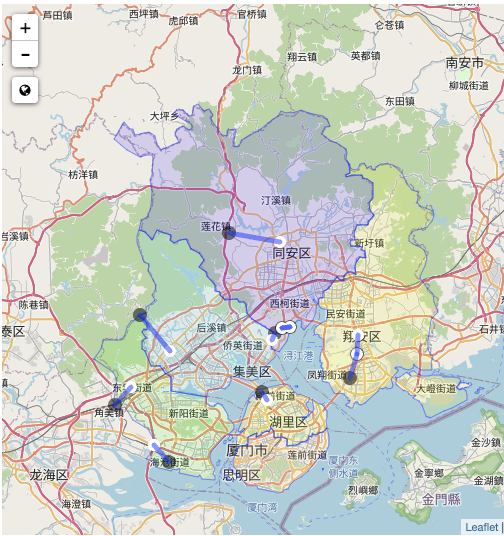

-   孤立点

    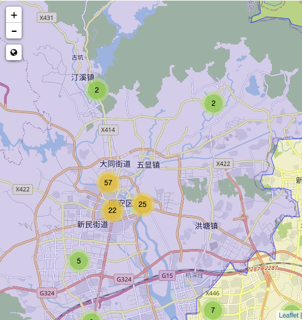

可以发现，这些方式各有侧重点，其中，点密度的方式更接近于本系列的目标需求。本系列除了有列示poi情况，还有以此为基础，进行一定类别的归类。这就导致点密度方式单纯以地理格栅进行的密度计算，无法满足这一需求。

在探查过程中，广州城区非常小的街道单位密度，某种程度上提供了更为简便的实现方式。经过几轮尝试，最终确认为以街道乡镇为颜色填充单位，既可以达到展示poi密度的目的，也可以为后续有实际意义的归类提供基础。

同时，这也回应了上一个问题：对于单体面积较大，poi代表性较差的业态类型，其代表性误差在以街道乡镇为单位的归类中，就能很好的抹平。

此外，还有[地图兴趣点聚合算法的探索与实践](https://zhuanlan.zhihu.com/p/301219657)、[基于POI数据的郑东新区服务业空间聚类研究](http://www.dlyj.ac.cn/article/2018/1000-0585/1000-0585-37-1-145.shtml)等文章提供了有意的参考。

### sf包的选择和使用

#### 为什么用sf包

早在我[这篇文章](https://pauke.netlify.app/2019/01/02/sf-ggplot2-%E6%9C%80%E7%AE%80%E6%AD%A5%E9%AA%A4%E5%AE%9E%E7%8E%B0%E4%B8%AD%E5%9B%BD%E5%9C%B0%E5%9B%BE%E6%95%B0%E6%8D%AE%E5%B1%95%E7%A4%BA/)时候，就已经领教了sf包的魔力。关于空间数据的分析挖掘工具，r方面的[这篇CRAN文章](https://cran.r-project.org/web/views/Spatial.html)给了很好的介绍和总结，归纳而言，最终选择使用sf作为基础工具的点在于：

-   以数据框的界面展示了空间数据，为进一步地数据匹配、清洗和整理提供了熟悉的基础；
-   能够链接ggplot等在内的r出图工具，为数据的展示提供了便利的工具接口；
-   对于空间数据的交并连等操作都有较为全面的功能覆盖。

在本系列文章开始探索初期，如何把各个poi（point）和以街道为单位的多边形（multipolygon）结合起来，进行以各个多边形为单位的运算成为当时的关键卡点。sf中通过st_join()和st_intersection()这类函数，就很好的达到了这个目的。
```r
insc_bs <-st_join(gz_t[,c("Name","layer1","layer2","geometry")],poi_bs)
```
做了交叉后，每个多边形内的点，均可匹配到对应的多边形内：
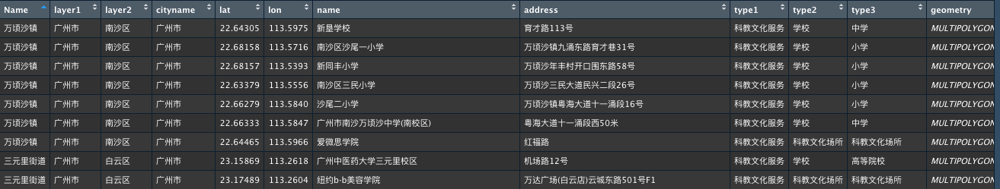


至于结合了ggplot的sf数据，更是能够轻便的进行图像叠造。例如在系列文章一开始就提到的建成区+街乡轮廓图：
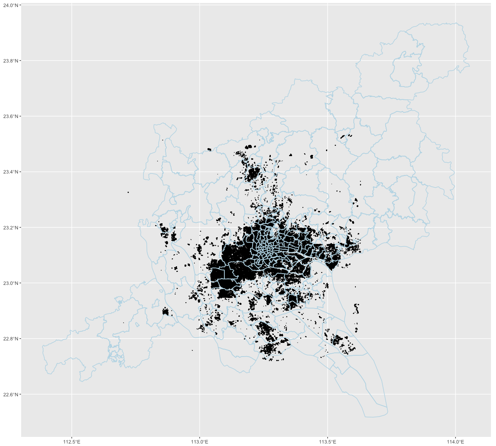

```r
ggplot()+ geom_sf(data = gz_c,aes(geometry = geometry))+ #街乡轮廓
  geom_sf(data = building,aes(geometry = geometry),color = "lightblue") #建成区数据
```


#### sf包使用新知

在最早的[关于sf的文章](https://pauke.netlify.app/2019/01/02/sf-ggplot2-%E6%9C%80%E7%AE%80%E6%AD%A5%E9%AA%A4%E5%AE%9E%E7%8E%B0%E4%B8%AD%E5%9B%BD%E5%9C%B0%E5%9B%BE%E6%95%B0%E6%8D%AE%E5%B1%95%E7%A4%BA/)里，关于地图的投影方式是通过coord_sf()函数选取PROJ4库中的方法来呈现。
```r
#以此来实现方位角投影法（Azimuthal）的特定投影
coord_sf(crs = "+proj=aeqd +lat_0=37 +lon_0=104") 
```

不过在本次尝试过程中，European Petroleum Survey Group (EPSG) 这套码可以以更为简洁的方式全面替代。具体而言，通过
```r
#以此来实现方位角投影法（Azimuthal）的特定投影
coord_sf(crs = st_crs(3857)) 
#默认使用的墨拖卡投影
coord_sf(crs = st_crs(4326))
```
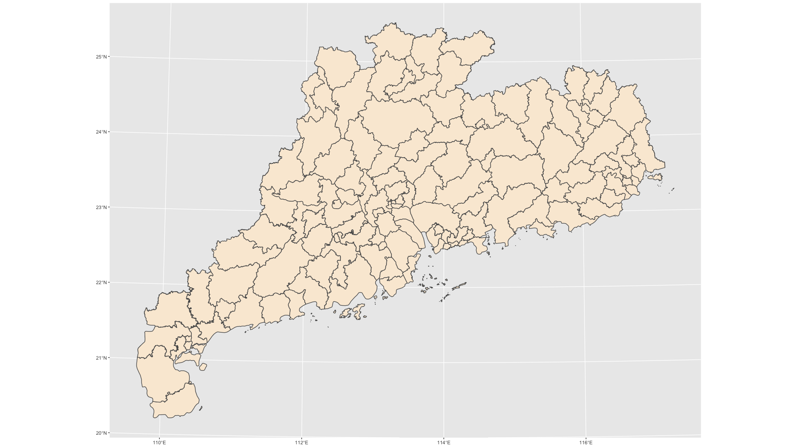


关于epsg中如何处理这两类投影方式的介绍文章[Difference between EPSG 4326 & 3857](https://gist.github.com/Rub21/49ed3e8fea3ae5527ea913bf80fbb8d7)。

### 模型选择的尝试和思路

聚类所要解决的，是在没有预先标准的前提下，对一堆有特征值的对象，在不断的迭代优化中，找到有理有据的区分组别的方案和结论。

聚类算法的介绍和使用总结，在[这本书](https://www.datanovia.com/en/product/practical-guide-to-cluster-analysis-in-r/?url=/5-bookadvisor/17-practical-guide-to-cluster-analysis-in-r/)有不错的归纳。其他可供参考的个别算法的实践还包括[DBSCAN聚类模型做数据分析](https://www.woshipm.com/data-analysis/4321606.html)、[聚类模型（k-means）做数据分析](https://www.woshipm.com/data-analysis/4303709.html)、[聚类分析最佳实践](https://blog.csdn.net/weixin_39713833/article/details/111297941)

#### 聚类方法尝试

k-mean作为这其中最为经典和常用的算法，一般是全定量变量数据最初选的方式。

经过简单的肘图确认分类数量：

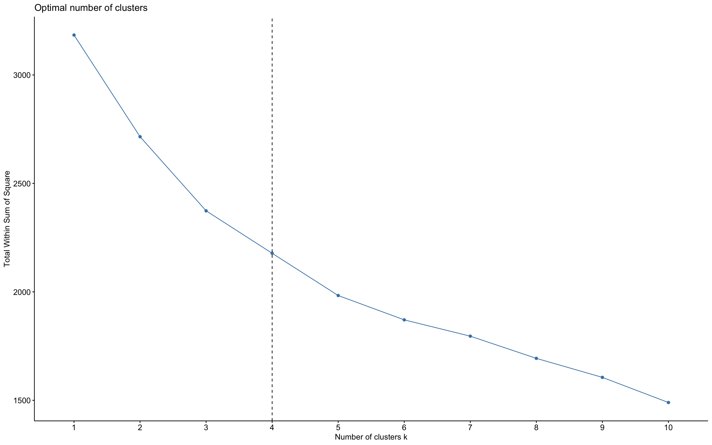

和最基础的kmean模型的探查：
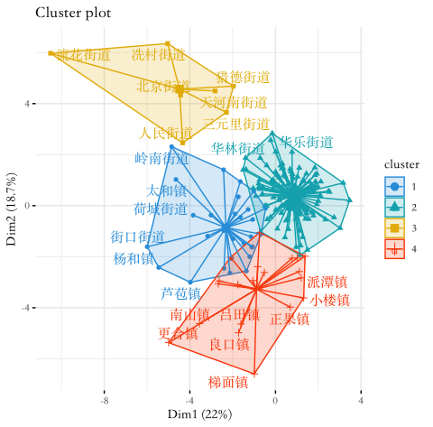

发现当前模型结果的分类重叠情况比较显著，三个分类基本都各自有重叠，表明整个模型还存在显著的可优化空间。

首先想到的是尝试不同的聚类算法：[DBSCAN](http://www.sthda.com/english/wiki/wiki.php?id_contents=7940)算法。根据该算法的步骤，计算可抵达最大距离值eps，用以确认合适的分类延伸范围：
```r
dbscan::kNNdistplot(d_sc, k =  5)
abline(h = 4, lty = 2)
```
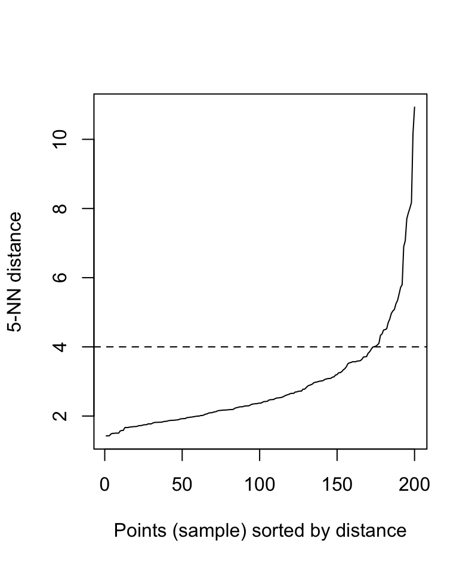

然后根据图示推荐确认该算法的参数：
```r
db <- fpc::dbscan(d_sc, eps = 4, MinPts = 2)
```
该算法的最终结论是：
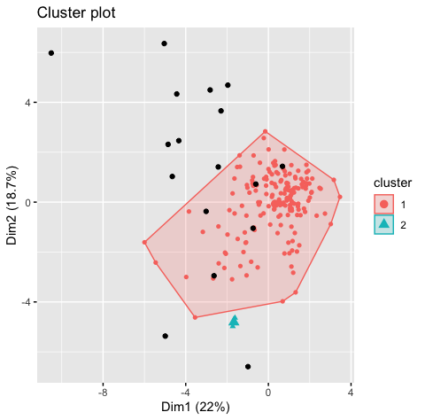

显然这个算法在本案中的结论更是不靠谱，以最低成群数量MinPts = 2的条件下，也仅有两个分类产出。与此同时，这也揭示了在当前的变量条件下，大部分分类对象都是高度聚积，有必要进行一定的变量取舍和转化。

为此，我首先想到的就是pca主成分分析进行变量降维，在一番搜寻后，找到了最后采用的算法包：[HCPC](http://www.sthda.com/english/articles/31-principal-component-methods-in-r-practical-guide/117-hcpc-hierarchical-clustering-on-principal-components-essentials/)。 关于后续的具体算法优化，[主体文章](https://pauke.netlify.app/2022/10/18/guangfo-convenience-exploration-with-poi-data-3/)中也比较详细的论述过，此处不再赘述。但主体文章为了保持整体可读性，就只展示了最终对比最有的方案，即分为4类。此处则可以进一步列示其他的探索，即分类做3类和5类的两个次优模型的结果：

##### 3类：

切分节点很高：
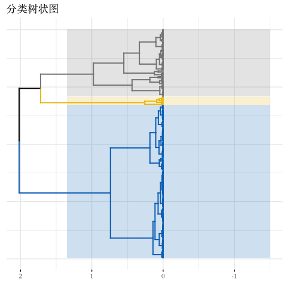

各个类群也边界清晰，几乎没有分类间的重叠：
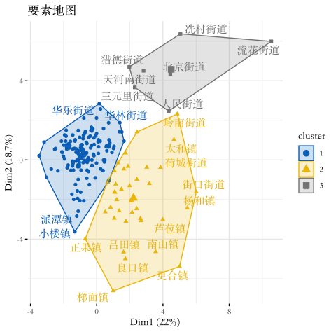
但这类的问题也在主体文章中提及，模型很漂亮，但实际解释力确存在问题。


##### 5类：

切分节点已经到了相对较低的位置：
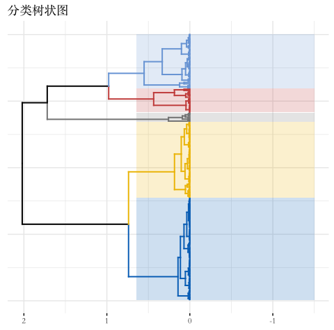

出现了1&2、3&4两个重叠严重的类群，毕竟该分类的1，2两类就是从3类分法中的第1类拆解出来的：

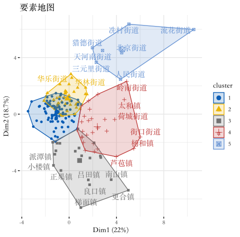

使用这个分类再具体查看新增的两个分类下的定量特征：
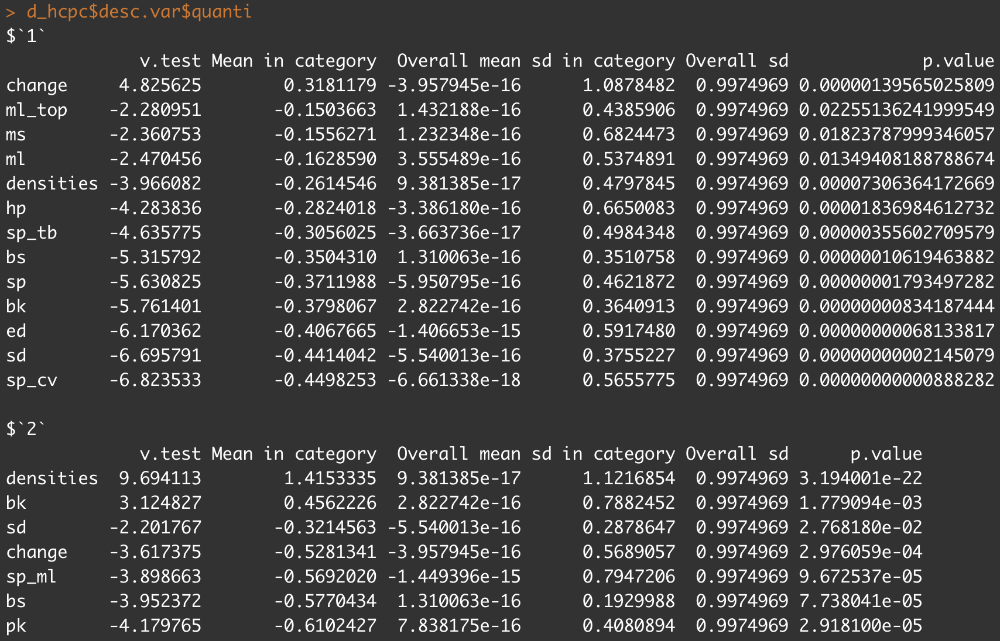

发现由各个特征因素组成的类别，并不是一个实际理解中成立的分类，所以并不支持这类的分法。


## 后续可挖掘的点

在本次系列文章的小项目资料收集过程中，还是有一些与本次主题有所差异，但依然有趣的点值得另辟文章进行探索：

- 广州和佛山在本次七普数据中的诸多变化。在虽然在街道乡镇层级的人口特征仅有常住人口和由此衍生的两次普查间的人口变化情况，但到了区一层级后，各种维度的人口学特征就丰富得多，是一个可以进一步挖掘的方向。

- POI数据的展现方式和分析切入方式。正如本文在列举poi数据的前有分析方法中提及的，还有很多方法可以进一步展开讨论。


